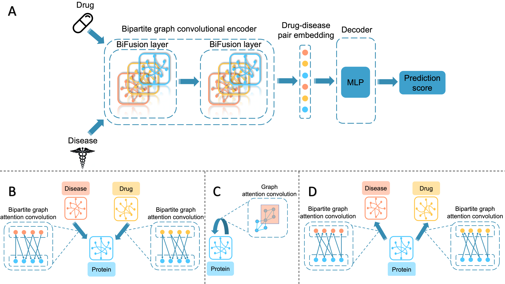

# BiFusion: Bipartite Graph Convolutional Networks for In Silico Drug Repurposing

### Authors: Zichen Wang, Mu Zhou and Corey Arnold

### Introduction

This repository is the Pytorch implementation of our ISMB 2020 paper 
'[Toward heterogeneous information fusion: bipartite graph convolutional networks for in silico drug repurposing](https://academic.oup.com/bioinformatics/article/36/Supplement_1/i525/5870495)'. 

BiFusion is a bipartite graph convolution network model for drug repurposing through heterogeneous information fusion. 
Our approach combines insights of multi-scale pharmaceutical information by constructing a multi-relational graph of drug–protein, disease-protein and protein–protein interactions.

### Usage
#### 'dataloader' directory
Contains the code for dataloader.
#### 'layer' directory
Contains the code for  model components.
#### 'model' directory
Contains the code for training and testing BiFusion model

Run the code as following:

    $ python BiFusion.py
    

### Requirements

BiFusion is tested to work under Python 3.6. 
The required dependencies are PyTorch, numpy, scikit-learn and PyTorch-Geometric.

### Citing

If this repository is useful for your research, please consider citing this paper:

    @article{wang2020toward,
      title={Toward heterogeneous information fusion: bipartite graph convolutional networks for in silico drug repurposing},
      author={Wang, Zichen and Zhou, Mu and Arnold, Corey},
      journal={Bioinformatics},
      volume={36},
      number={Supplement\_1},
      pages={i525--i533},
      year={2020},
      publisher={Oxford University Press}
    }

### Questions

Please send any questions you might have about this repository to <zcwang0702@ucla.edu>
